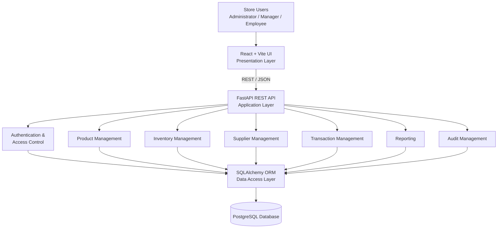
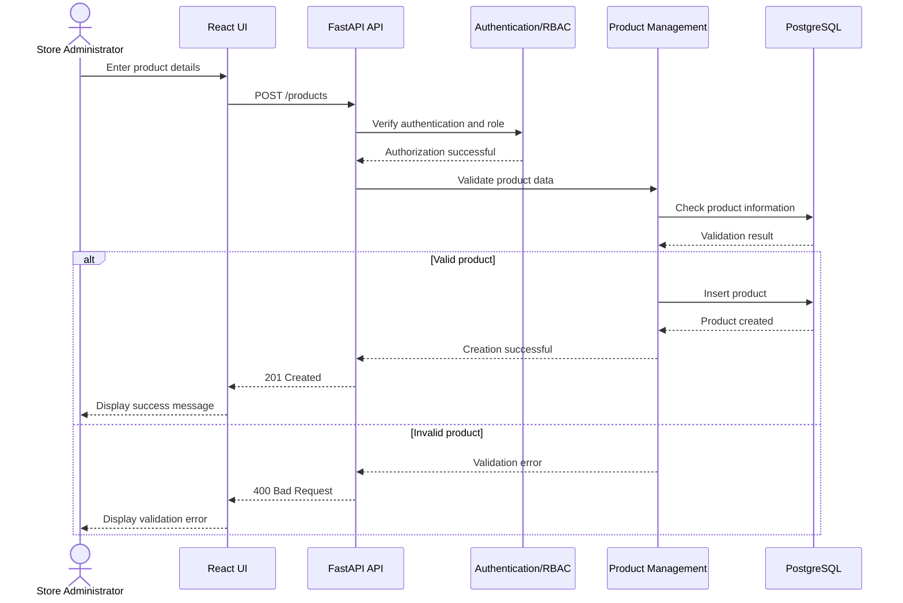
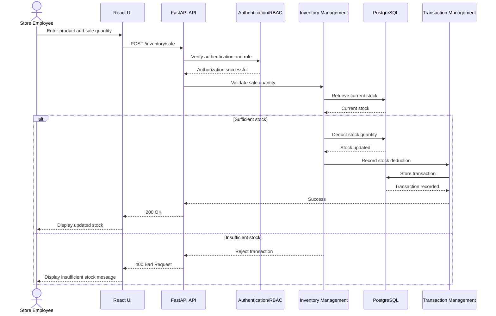

# Software Architecture and Design Specification

**Project:** Electronics Store Inventory Management System  
**Version:** 1.0  
**Authors:** Group 12  
**Date:** 02-10-2026  
**Status:** Draft

## Revision History

| Version | Date | Author | Change Summary |
|---|---|---|---|
| 1.0 | 02-10-2026 | Group 12 | Initial architecture and design specification |

## Approvals

| Role | Name | Signature/Date |
|---|---|---|
| Project Team | Group 12 | |
| Faculty / Instructor | | |

# 1. Introduction

## 1.1 Purpose

This document specifies the software architecture and design of the Electronics Store Inventory Management System. It describes the major software components, their responsibilities, interactions, technology choices, security considerations, interfaces, and design decisions.

The architecture is derived from the Software Requirements Specification (SRS) and provides a technical structure for implementing and testing the system.

## 1.2 Scope

The Electronics Store Inventory Management System is a web-based application for managing the inventory operations of an electronics store.

The system supports:

- User authentication and role-based access control
- Product management
- Inventory and stock management
- Supplier management
- Inventory transaction recording
- Inventory reporting
- Audit history

The system does not cover online payment processing, delivery management, or the internal operations of external suppliers.

## 1.3 Audience

This document is intended for:

- Developers responsible for implementing the system
- Testers responsible for verifying the system
- Scrum Master responsible for coordinating development activities
- Store administrators and managers
- Store employees
- Faculty members and project evaluators

## 1.4 Definitions

| Term | Definition |
|---|---|
| SRS | Software Requirements Specification |
| UI | User Interface |
| API | Application Programming Interface |
| RBAC | Role-Based Access Control |
| CRUD | Create, Read, Update, Delete |
| REST | Representational State Transfer |
| ORM | Object-Relational Mapping |
| SKU | Stock Keeping Unit |
| RTM | Requirements Traceability Matrix |

# 2. Document Overview

This document describes the architecture and detailed design of the Electronics Store Inventory Management System.

It presents:

- Architecture goals and constraints
- Stakeholders and their concerns
- Major system components
- Selected architecture pattern
- Technology stack and data stores
- Component interactions
- Security architecture
- Requirement traceability
- Sequence diagrams for major system flows
- API designs
- Error handling, logging, and monitoring
- User experience considerations
- Open issues and future enhancements

# 3. Architecture

## 3.1 Goals & Constraints

### Architecture Goals

The architecture is designed to achieve the following goals:

1. **Maintainability**  
   Separate the presentation, application logic, and data access responsibilities.

2. **Modularity**  
   Organize the system into independent functional modules such as Product Management, Inventory Management, Supplier Management, and Authentication.

3. **Security**  
   Ensure that protected functions are accessible only to authenticated and authorized users.

4. **Data Integrity**  
   Maintain consistent product, inventory, supplier, and transaction information.

5. **Testability**  
   Allow individual components and modules to be tested independently.

6. **Scalability**  
   Provide a structure that can accommodate additional inventory-related features in future iterations.

### Constraints

The architecture is subject to the following constraints:

- The system is a web-based application.
- The system depends on the availability of the database.
- Role-based access must be enforced.
- Product and inventory information must remain consistent.
- The project must be completed within the available time and resources.
- Communication between client and server uses standard HTTP/HTTPS mechanisms.

## 3.2 Stakeholders & Concerns

| Stakeholder | Primary Concerns |
|---|---|
| Store Administrator / Manager | Product management, inventory accuracy, supplier information, reports, security |
| Store Employee | Product search, stock information, incoming stock, sales-related stock updates |
| Scrum Master | Requirement tracking, coordination, integration, project progress |
| Developers | Modularity, maintainability, testability, clear interfaces |
| Testers | Requirement coverage, functional correctness, security, performance |
| Faculty / Evaluators | Requirement compliance, architecture quality, testing evidence |

The Store Administrator/Manager and Store Employee are operational users of the system. The Scrum Master is responsible for project coordination and is not an operational user of the inventory system.

                    ┌─────────────────────────┐
                    │       Store Users       │
                    │ Admin / Manager /       │
                    │ Employee                │
                    └────────────┬────────────┘
                                 │
                                 ▼
                    ┌─────────────────────────┐
                    │    React + Vite UI      │
                    │   Presentation Layer    │
                    └────────────┬────────────┘
                                 │
                         REST / JSON
                                 │
                                 ▼
                    ┌─────────────────────────┐
                    │     FastAPI Backend     │
                    │      API Layer          │
                    ├─────────────────────────┤
                    │ Authentication & RBAC   │
                    │ Product Management      │
                    │ Inventory Management    │
                    │ Supplier Management     │
                    │ Transaction Management  │
                    │ Reporting                │
                    │ Audit Management        │
                    └────────────┬────────────┘
                                 │
                                 ▼
                    ┌─────────────────────────┐
                    │    SQLAlchemy ORM       │
                    │    Data Access Layer    │
                    └────────────┬────────────┘
                                 │
                                 ▼
                    ┌─────────────────────────┐
                    │       PostgreSQL        │
                    │          DB             │
                    └─────────────────────────┘

## 3.3 UML Component Diagram

The system follows a layered architecture consisting of a presentation layer, application/API layer, data access layer, and database layer.

The major functional components are:

- Authentication and Access Control
- Product Management
- Inventory Management
- Supplier Management
- Transaction Management
- Reporting
- Audit Management

The component diagram illustrates the dependencies and communication between these components.

## 3.4 Component Descriptions

| Component | Responsibility |
|---|---|
| React + Vite UI | Provides the web interface through which authorized users interact with the system. |
| Authentication & Access Control | Authenticates users and enforces role-based access to protected functions. |
| Product Management | Adds, updates, deletes, searches, and displays electronic product information. |
| Inventory Management | Maintains stock quantities, records incoming stock, processes stock deductions, identifies low-stock products, and prevents negative stock. |
| Supplier Management | Maintains supplier information and provides supplier details. |
| Transaction Management | Records inventory transactions such as stock additions and deductions. |
| Reporting | Generates inventory and stock reports. |
| Audit Management | Maintains records of important operations together with the responsible user and timestamp. |
| SQLAlchemy Data Access Layer | Provides database access between application services and PostgreSQL. |
| PostgreSQL Database | Stores users, products, inventory, suppliers, transactions, and audit information. |

## 3.5 Chosen Architecture Pattern and Rationale

### Selected Pattern: Layered Architecture

The Electronics Store Inventory Management System uses a layered architecture.

The main layers are:

1. **Presentation Layer**
   - React + Vite
   - Handles user interaction and presentation.

2. **API / Application Layer**
   - FastAPI
   - Receives HTTP requests and coordinates application operations.

3. **Business Logic Layer**
   - Implements authentication, product management, inventory management, supplier management, reporting, transactions, and audit operations.

4. **Data Access Layer**
   - SQLAlchemy
   - Handles interaction between application logic and the database.

5. **Data Layer**
   - PostgreSQL
   - Stores persistent system data.

### Rationale

Layered architecture provides separation of concerns between user interface, application logic, data access, and persistent storage.

This separation supports maintainability, modular development, testing, and easier modification of individual components without requiring changes throughout the entire system.

## 3.6 Technology Stack & Data Stores

| Layer | Technology | Purpose |
|---|---|---|
| Frontend | React | User interface |
| Frontend Build Tool | Vite | Development and build tooling |
| Backend | Python + FastAPI | REST API and application services |
| ORM | SQLAlchemy | Database access and object-relational mapping |
| Database | PostgreSQL | Persistent data storage |
| API Format | REST + JSON | Frontend-backend communication |
| Version Control | Git + GitHub | Source code and collaboration |
| CI/CD | GitHub Actions | Automated build and test execution |
| API Testing | Postman | API validation |
| Backend Testing | Pytest | Unit and integration testing |
| Frontend Testing | Vitest + React Testing Library | UI/component testing |

## 3.7 Risks & Mitigations

| Risk | Impact | Mitigation |
|---|---|---|
| Database failure | Inventory and product information may become unavailable. | Use database backups and proper error handling. |
| Incorrect stock updates | May result in inaccurate inventory information. | Validate stock operations and use transactional database updates. |
| Unauthorized access | Sensitive inventory and administrative functions may be exposed. | Implement authentication and role-based access control. |
| Invalid product data | Incorrect product information may enter the system. | Apply frontend and backend input validation. |
| API communication failure | Users may be unable to perform operations. | Provide standardized error handling and user-friendly error messages. |
| Integration conflicts between team members | Features may become difficult to merge or may introduce defects. | Use Git branches, pull requests, code reviews, and regular integration. |
| Incomplete requirement coverage | Some SRS requirements may remain unimplemented or untested. | Maintain RTM mapping requirements to architecture modules and test cases. |

---

## 3.8 Traceability to Requirements

The architecture components are mapped to the functional and non-functional requirements defined in the SRS.

| Requirement ID | Requirement | Architecture Component |
|---|---|---|
| ES-F-001 | Valid user login | Authentication & Access Control |
| ES-F-002 | Reject invalid login | Authentication & Access Control |
| ES-F-003 | Role-based access | Authentication & Access Control |
| ES-F-004 | Add product | Product Management |
| ES-F-005 | Update product | Product Management |
| ES-F-006 | Delete product | Product Management |
| ES-F-007 | Search product | Product Management |
| ES-F-008 | View product details | Product Management |
| ES-F-009 | Maintain stock quantity | Inventory Management |
| ES-F-010 | Record incoming stock | Inventory Management |
| ES-F-011 | Deduct stock after sale | Inventory Management |
| ES-F-012 | Identify low-stock products | Inventory Management |
| ES-F-013 | Prevent negative stock | Inventory Management |
| ES-F-014 | Manage suppliers | Supplier Management |
| ES-F-015 | View supplier details | Supplier Management |
| ES-F-016 | Record inventory transactions | Transaction Management |
| ES-F-017 | Generate inventory reports | Reporting |
| ES-F-018 | Maintain audit history | Audit Management |
| ES-NF-001 | Search results within 3 seconds for 90% of requests | Product Management / Database |
| ES-NF-002 | At least 99% availability during store operating hours | Backend / Database / Deployment |
| ES-NF-003 | Protect credentials and sensitive information | Authentication & Access Control / Security |
| ES-NF-004 | User-friendly interface | React + Vite UI |
| ES-NF-005 | Maintain data integrity | Business Logic / SQLAlchemy / PostgreSQL |

> **Note:** The architecture component mappings above are design mappings. The SRS defines the requirements; the architecture assigns those requirements to implementation components.

---

## 3.9 Security Architecture

Security is implemented across the presentation, application, and data layers.

### Authentication

Users must authenticate before accessing protected system functionality.

The authentication component will:

- Accept user credentials through the login interface.
- Validate the supplied credentials.
- Reject invalid credentials.
- Establish an authenticated session/token for authorized requests.
- Avoid storing passwords in plaintext.

### Role-Based Access Control

The system will use role-based access control to restrict operations according to the user's assigned role.

The primary operational roles are:

- Store Administrator / Manager
- Store Employee

Access permissions will be checked at the backend rather than relying only on frontend controls.

### Input Validation

Input validation will be performed at the API boundary and, where appropriate, at the user interface.

Validation will cover:

- Required fields
- Data types
- Numeric values
- Product quantities
- Product prices
- Invalid or malformed requests
- Duplicate or conflicting product information

### Data Protection

Sensitive information should not be exposed through:

- Error messages
- Application logs
- API responses where it is not required
- Client-side storage where unnecessary

Communication between the client and server should use HTTPS when deployed over a network.

### Security Threat Considerations

| Threat | Example | Mitigation |
|---|---|---|
| Spoofing | Attacker attempts to use another user's credentials. | Authentication and secure credential handling. |
| Tampering | Unauthorized modification of product or stock data. | RBAC, server-side validation, database constraints, audit history. |
| Information Disclosure | Sensitive information exposed through API responses or logs. | Access control, controlled responses, secure logging. |
| Denial of Service | Excessive requests prevent normal operation. | Request validation, rate limiting where required, monitoring. |
| Elevation of Privilege | Employee attempts to perform administrator-only operations. | Server-side RBAC checks. |

---

# 4. Design

## 4.1 Design Overview

The system follows a layered design in which each layer has a defined responsibility.

- **Presentation Layer:** React + Vite provides the web-based user interface.
- **Application/API Layer:** FastAPI handles REST requests and coordinates application operations.
- **Business Logic:** Functional modules implement authentication, product management, inventory management, supplier management, transactions, reporting, and auditing.
- **Data Access Layer:** SQLAlchemy provides database access.
- **Data Layer:** PostgreSQL stores persistent system data.

The detailed component architecture is presented in Section 4.2.

## 4.2 UML Component Diagram

The following diagram represents the proposed component architecture of the Electronics Store Inventory Management System.



## 4.3 UML Sequence Diagrams

The following sequence diagrams illustrate important interactions between users, the frontend, backend services, and the database.

### 4.3.1 Add Product

The following sequence describes how a Store Administrator adds a new product to the system.



### 4.3.2 Record Sale and Deduct Stock

The following sequence describes how a Store Employee records a sale and the corresponding stock quantity is deducted.



## 4.4 API Design

The system uses RESTful APIs with JSON for communication between the React frontend and FastAPI backend.

The following APIs represent the main interfaces for Product Management and Inventory Management.

### 4.4.1 Add Product API

**Endpoint:** `POST /products`

**Purpose:** Creates a new product in the inventory system.

**Request:**

```json
{
  "product_name": "Wireless Keyboard",
  "category": "Computer Accessories",
  "price": 1499.00,
  "quantity": 25
}
```

**Response:**

```json
{
  "message": "Product created successfully",
  "product_id": "P001"
}
```

**Possible Status Codes:**

- `201 Created` – Product created successfully
- `400 Bad Request` – Invalid product data
- `401 Unauthorized` – User is not authenticated
- `403 Forbidden` – User does not have permission
- `409 Conflict` – Product information conflicts with an existing product

### 4.4.2 Search Products API

**Endpoint:** `GET /products?search=keyboard`

**Purpose:** Searches for products by name, category, or product ID.

**Response:**

```json
{
  "products": [
    {
      "product_id": "P001",
      "product_name": "Wireless Keyboard",
      "category": "Computer Accessories",
      "price": 1499.00,
      "quantity": 25
    }
  ]
}
```

**Possible Status Codes:**

- `200 OK` – Search completed successfully
- `400 Bad Request` – Invalid search request
- `401 Unauthorized` – User is not authenticated

### 4.4.3 Update Product API

**Endpoint:** `PUT /products/{product_id}`

**Purpose:** Updates the details of an existing product.

**Request:**

```json
{
  "product_name": "Wireless Keyboard",
  "category": "Computer Accessories",
  "price": 1599.00
}
```

**Response:**

```json
{
  "message": "Product updated successfully"
}
```

**Possible Status Codes:**

- `200 OK` – Product updated successfully
- `400 Bad Request` – Invalid product data
- `401 Unauthorized` – User is not authenticated
- `403 Forbidden` – User does not have permission
- `404 Not Found` – Product does not exist

### 4.4.4 Record Sale API

**Endpoint:** `POST /inventory/sale`

**Purpose:** Records a sale and deducts the sold quantity from current stock.

**Request:**

```json
{
  "product_id": "P001",
  "quantity": 2
}
```

**Response:**

```json
{
  "message": "Sale recorded successfully",
  "remaining_quantity": 23
}
```

**Possible Status Codes:**

- `200 OK` – Sale recorded and stock updated
- `400 Bad Request` – Invalid quantity or insufficient stock
- `401 Unauthorized` – User is not authenticated
- `403 Forbidden` – User does not have permission
- `404 Not Found` – Product does not exist

## 4.5 Error Handling, Logging & Monitoring

The system uses standardized error handling, controlled logging, and monitoring mechanisms to improve reliability, security, and maintainability.

### 4.5.1 Error Handling

The backend uses standard HTTP status codes to communicate the result of API requests.

| Status Code | Meaning | Example |
|---|---|---|
| 200 OK | Request completed successfully | Product search or stock update |
| 201 Created | Resource created successfully | New product added |
| 400 Bad Request | Invalid input or operation | Invalid quantity or product data |
| 401 Unauthorized | Authentication is required or invalid | Invalid login credentials |
| 403 Forbidden | User does not have permission | Employee attempts an administrator-only operation |
| 404 Not Found | Requested resource does not exist | Product ID not found |
| 409 Conflict | Request conflicts with existing data | Duplicate product information |
| 500 Internal Server Error | Unexpected server-side error | Unhandled application or database error |

Error responses should provide a clear message to the frontend without exposing sensitive system information.

### 4.5.2 Logging

The system will maintain application logs for important system events and errors.

Important events to be logged include:

- Successful and failed authentication attempts
- Unauthorized access attempts
- Product creation, update, and deletion
- Inventory stock updates
- Inventory transaction failures
- Database or API errors
- Unexpected application errors

Logs should include relevant information such as the timestamp, operation, user where applicable, and error details.

Sensitive information such as passwords and authentication credentials must not be stored in logs.

### 4.5.3 Audit Logging

Important inventory and administrative operations will be recorded in the audit history.

Audit records should contain:

- User performing the operation
- Operation performed
- Affected resource or product
- Date and time of the operation

Audit logging supports accountability and helps trace important changes made to system data.

### 4.5.4 Monitoring

The system will monitor important operational and performance indicators, including:

- API errors
- Authentication failures
- Database connectivity
- Failed inventory operations
- Search response time
- System availability

The search performance requirement will be monitored to verify that search results are returned within the specified performance target for the required proportion of requests.

Monitoring information can be used to identify failures, performance issues, and potential security problems.

## 4.6 UX Design

The user interface is designed to provide simple and consistent interaction for Store Administrators/Managers and Store Employees.

### 4.6.1 Login Screen

The login screen allows users to enter their credentials and access the system.

The interface should provide:

- Username or email field
- Password field
- Login button
- Clear error message for invalid credentials

Users are granted access to system functions according to their assigned role.

### 4.6.2 Dashboard

The dashboard provides an overview of important inventory information.

It may display:

- Total number of products
- Current stock information
- Low-stock products
- Recent inventory transactions
- Quick access to frequently used operations

### 4.6.3 Product Management

The Product Management interface allows authorized users to:

- Add new products
- Update product information
- Delete products
- Search for products
- View product details

Forms should provide clear labels and validation messages for invalid or missing information.

### 4.6.4 Inventory Management

The Inventory Management interface allows users to view and manage stock information.

The interface should support:

- Viewing current stock quantities
- Recording incoming stock
- Recording stock deductions after sales
- Identifying low-stock products
- Displaying errors when an operation would result in negative stock

### 4.6.5 Supplier Management

The Supplier Management interface allows authorized users to:

- Add supplier information
- Maintain supplier information
- View supplier details

Supplier information should be presented in a clear and structured format.

### 4.6.6 Reports and Audit History

The Reports interface provides inventory and stock information in a structured format.

The Audit History interface allows authorized users to review important operations together with the responsible user and timestamp.

### 4.6.7 Usability Considerations

The interface should follow these usability principles:

- Consistent navigation and layout
- Clear labels and instructions
- Meaningful error messages
- Confirmation messages after successful operations
- Appropriate validation before submitting forms
- Readable tables and structured information
- Role-appropriate access to system functions

## 4.7 Open Issues & Next Steps

### 4.7.1 Open Issues

The following design details will be finalized during implementation:

- Final database schema and relationships between tables
- Detailed role-permission matrix for Administrator/Manager and Employee
- Authentication and session/token implementation
- Final API naming and request/response formats
- Representation of minimum stock thresholds
- Deployment environment and configuration
- Monitoring and logging configuration

### 4.7.2 Next Steps

The planned implementation activities are:

1. Finalize the database schema and relationships.
2. Implement authentication and role-based access control.
3. Implement Product Management functionality.
4. Implement Inventory Management functionality.
5. Implement Supplier Management functionality.
6. Implement Transaction and Audit Management functionality.
7. Implement inventory reporting.
8. Develop unit and integration tests.
9. Integrate automated testing through GitHub Actions.
10. Perform system and acceptance testing.
11. Update the Requirements Traceability Matrix with implementation and test results.

# 5. Appendices

## 5.1 Glossary

| Term | Definition |
|---|---|
| API | Application Programming Interface used for communication between software components. |
| CRUD | Create, Read, Update, Delete operations performed on system data. |
| FastAPI | Python web framework used to develop the REST API. |
| ORM | Object-Relational Mapping used to interact with the database through application objects. |
| PostgreSQL | Relational database management system used for persistent data storage. |
| RBAC | Role-Based Access Control used to restrict system operations according to user roles. |
| REST | Architectural style used for communication between the frontend and backend through HTTP requests. |
| React | JavaScript library used to build the web-based user interface. |
| SQLAlchemy | Python ORM used for database access. |
| SRS | Software Requirements Specification defining the system requirements. |
| RTM | Requirements Traceability Matrix used to map requirements to implementation and testing. |
| Vite | Frontend development and build tool used with React. |

## 5.2 References

The following project documents and resources were used in preparing this architecture specification:

- Software Requirements Specification for the Electronics Store Inventory Management System
- Software Architecture and Design Specification template provided for the Software Engineering project
- Software Engineering project requirements and guidelines provided by the course instructor

## 5.3 Tools and Technologies

The proposed implementation uses the following tools and technologies:

- React
- Vite
- Python
- FastAPI
- SQLAlchemy
- PostgreSQL
- Git
- GitHub
- GitHub Actions
- Pytest
- Vitest
- React Testing Library
- Postman
- Mermaid